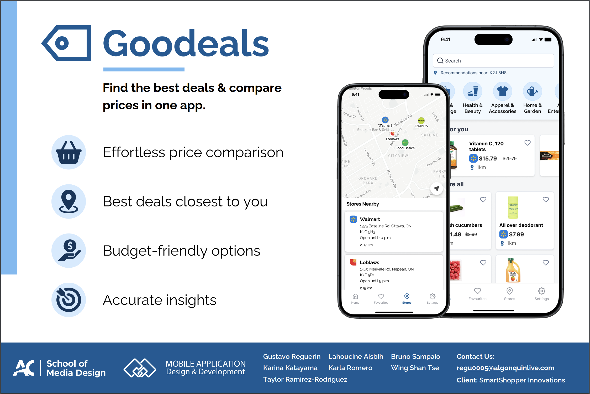
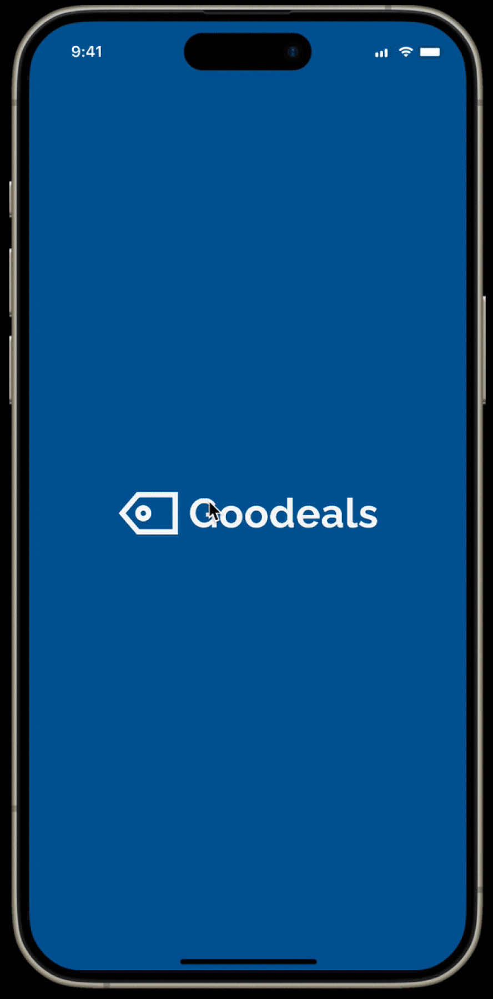
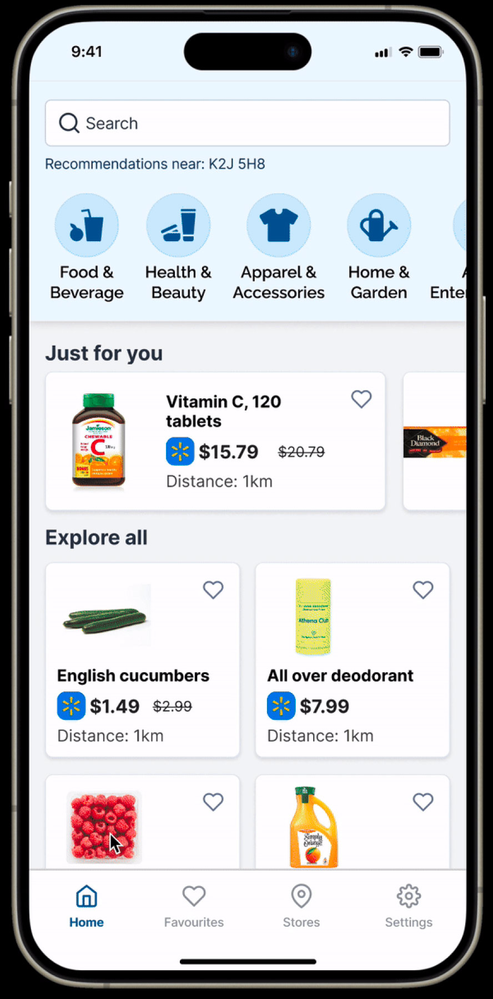
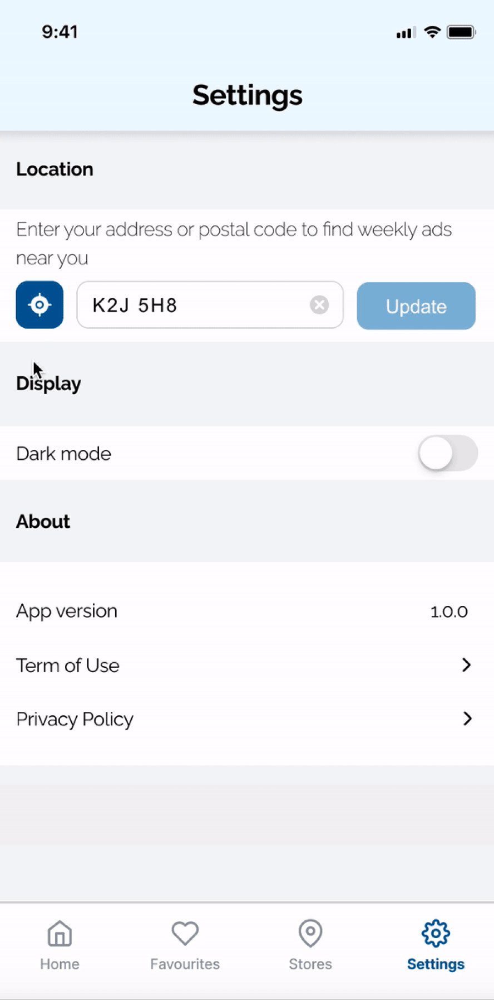

<!-- PROJECT LOGO -->
<p align="center">
  <a href="">
    
  </a>
  <p align="center">
Search for deals, and view real-time price comparisons
    <br />
    <a href="ReadMe_files/Goodeals_doc.pdf"><strong>Explore the docs »</strong></a>
    <br />
    <br />
</p>


## About The Project
<P>
Goodeals is a mobile app designed to help consumers save money and optimize their grocery shopping experience. This app allows shoppers to search for deals, and view real-time price comparisons across various stores in their area.

YouTube link : https://www.youtube.com/watch?v=ilSbFSLbG7M
 </p>
 <a href="ReadMe_files/poster.png">
    
  </a>

###  Requirements
- NodeJs 20.10 or higher
- NPM 10.2.3 or higher
- Xcode 15.3 or higher
- macOS 14.3 or higher
- Android Studio 2021.1.1 or higher


### Built With
#### Major Frameworks
- [Node JS](https://nodejs.org/en/docs/)
- [pSQL](https://www.postgresql.org/docs/)
- [React Native](https://reactnative.dev/)

#### Development Toolkit:

- [VS Code](https://code.visualstudio.com/) (IDE)
- [Expo](https://expo.io/)


### How to run the development environment.
- Clone the repository to your Mac.
- Navigate to the project root directory.
- Run npm install
- (Optional) Run npm run fix to correct/update any expo dependencies.
- Run npm run start to run expo
- To start the development on the ios simulator, run npm run ios
- To start the development on the Android emulator, run npm run android
- To test the app using the Expo Go app instead of compiling the app, run npm run dev npm run dev-ios or npm run dev-android

<!-- Features list -->

## Features
- [x] Search product by category
- [x] find the nearest store
- [x] Search by postal code
- [x] Locate stores in the map


[**API Documentation »**](ReadMe_files/API_Documentation.pdf)


<!-- Getting Started -->

## Getting Started

### Prerequisites

#### Goodeals Mobile App

- Install npm

```sh
npm install npm@latest -g
```

- Install Expo CLI

```sh
npm install --global expo-cli
```

- Install Libraries

```sh
expo install
```

#### Goodeals Dashboard

- Install npm

```sh
npm install npm@latest -g
```

- Install npm pacakges

```sh
npm i
```

- Copy the .env template following the steps...

## Usage

#### Current Screens in Development for Phase 1:
<a href="ReadMe_files/ScreenShoot1.jpg">
    
</a>
<a href="ReadMe_files/ScreenShoot2.jpg">
    
</a>

<a href="ReadMe_files/ScreenShoot3.jpg">
    
</a>


<!-- Contact -->
## Contact

- **Project Lead:** [Gustavo Reguerin](mailto:regu0005@algonquinlive.com)
- **Technical Lead:** [Bruno Sampaio](mailto:murt0021@algonquinlive.com)
- **Design Lead:** [Lahoucine Aisbih](mailto:aisb0001@algonquinlive.com)
- **API Developer:** [Karla Romero](mailto:rome0074@algonquinlive.com)
- **Front-end Developer:** [Taylor Jay Fox (Gustavo Ramirez)](mailto:rami0101@algonquinlive.com)
- **UX Researcher:** [Wing Shan, Tse](mailto:tse00020@algonquinlive.com)
- **UX Designer:** [Karina Katayama](mailto:kata0049@algonquinlive.com)

##  Libraries Documentation
- Expo https://docs.expo.dev/guides/overview/
- UI Kitten https://akveo.github.io/react-native-ui-kitten/docs/components/components-overview
- Expo Router https://docs.expo.dev/router/introduction/
- NativeWind https://www.nativewind.dev/v4/overview

<!-- Acknowledgements -->
## Acknowledgements

We express our deepest gratitude to everyone who has contributed to the success of this project. Our heartfelt appreciation goes out to our clients and professors, whose guidance, expertise, and unwavering support have been instrumental from inception to completion.
